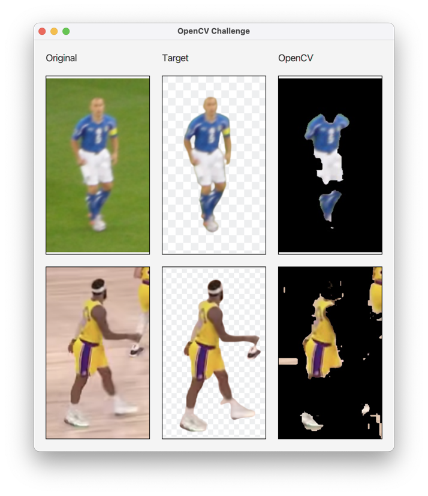

# OpenCV Challenge ... a cry for help!

In this project I am trying to use OpenCV (https://opencv.org) to remove the background of images showing soccer and 
basketball players. 

The project already implements a solution, but the quality is not good enough to guarantee that the
players will be completely visible. 

Another problem is that the background is not transparent. 

The code I am using is good old "found it on the web" code, meaning I don't really know what it does and how it does it. I would really
appreciate it if anyone found the time and interest to help me out. 

The main class is com.dlsc.opencv.ChallengeApp. The application can be launched via the "javafx" maven plugin.

The code for the OpenCV operations can be found inside OpenCVUtil. 
